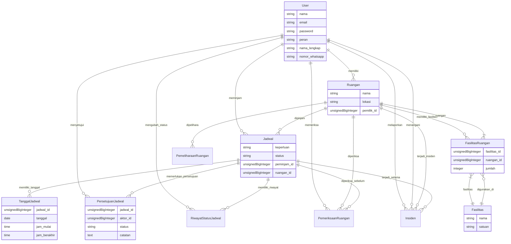
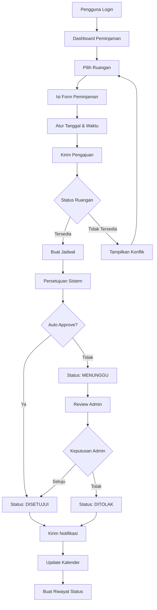
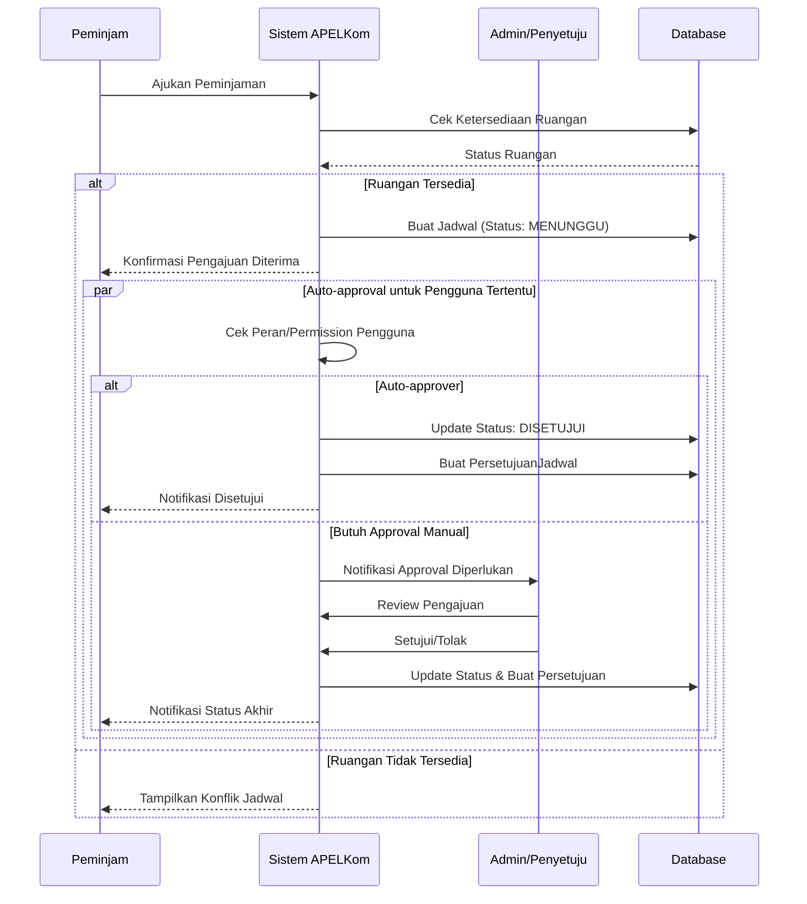
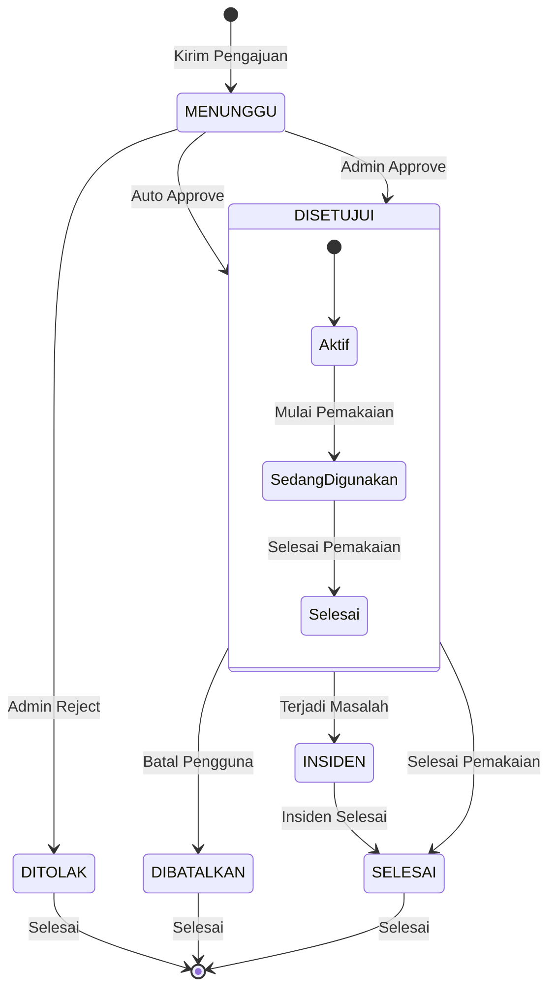
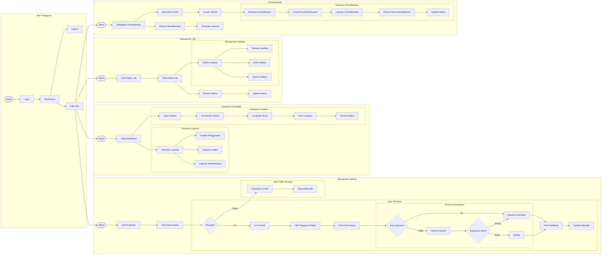
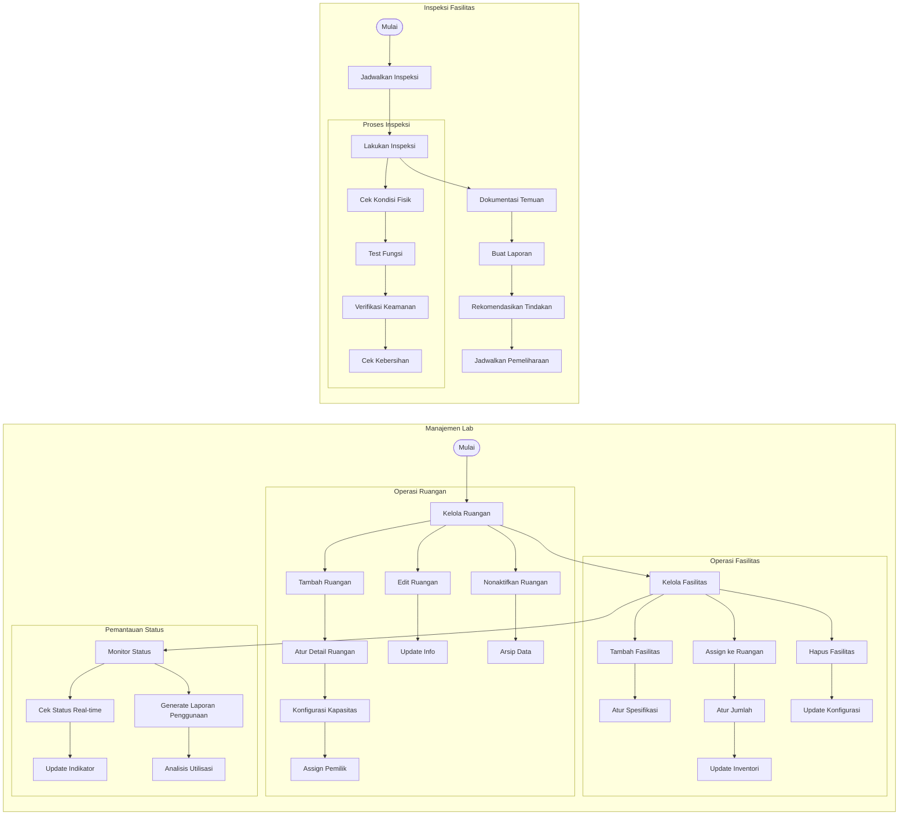
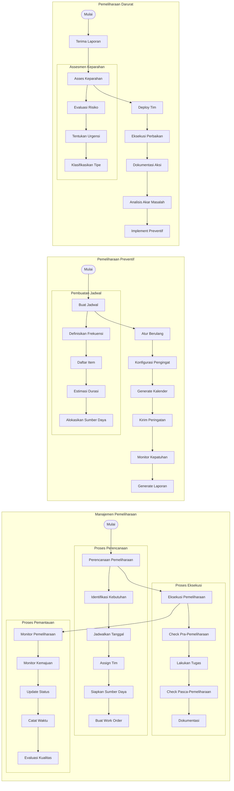

# APELKom - Aplikasi PEminjaman Laboratorium Komputer

Sistem manajemen peminjaman laboratorium komputer untuk Fakultas Ekonomi dan Bisnis Universitas Lambung Mangkurat.

## 📋 Tentang

**APELKom** (Aplikasi PEminjaman Laboratorium Komputer) adalah sistem manajemen peminjaman laboratorium komputer yang dirancang khusus untuk FAKULTAS EKONOMI DAN BISNIS UNIVERSITAS LAMBUNG MANGKURAT. Aplikasi ini menyediakan solusi terintegrasi untuk manajemen jadwal, monitoring fasilitas, pelaporan insiden, dan pemeliharaan lab komputer.

## 🚀 Fitur Utama

### Manajemen Jadwal
- Peminjaman lab komputer dengan sistem approval otomatis
- Notifikasi real-time untuk status persetujuan
- Kalender publik untuk melihat ketersediaan lab
- Histori peminjaman dan penggunaan

### Manajemen Lab
- Monitoring status dan ketersediaan lab komputer
- Manajemen fasilitas dan peralatan lab
- Kapasitas dan utilisasi lab secara real-time
- Status pemeliharaan dan perbaikan

### Pelaporan & Analitik
- Laporan insiden dengan sistem tracking lengkap
- Analitik utilisasi lab dan trend penggunaan
- Dashboard admin dengan statistik komprehensif
- Export laporan dalam berbagai format

### Pemeliharaan
- Jadwal pemeliharaan rutin
- Tracking status perbaikan fasilitas
- Notifikasi otomatis untuk jadwal maintenance
- Histori pemeliharaan lab

## 🛠 Teknologi

- **Backend**: Laravel 12
- **Frontend**: Livewire 3 dengan Flux UI
- **Database**: MySQL/PostgreSQL
- **Testing**: Pest PHP
- **Styling**: Tailwind CSS v4
- **Icons**: Font Awesome

## 📦 Instalasi

### Persyaratan Sistem
- PHP 8.2+
- Composer
- Node.js 18+
- MySQL 8+ atau PostgreSQL 12+

### Langkah Instalasi

1. **Clone repository**
```bash
git clone https://github.com/kikiimdev/peminjaman-labkom-laravel-12
cd peminjaman-labkom-laravel-12
```

2. **Install dependencies**
```bash
composer install
npm install
```

3. **Konfigurasi environment**
```bash
cp .env.example .env
php artisan key:generate
```

4. **Konfigurasi database**
Edit file `.env`:
```env
DB_CONNECTION=mysql
DB_HOST=127.0.0.1
DB_PORT=3306
DB_DATABASE=apelkom_unlam
DB_USERNAME=root
DB_PASSWORD=
```

5. **Run migrations**
```bash
php artisan migrate --seed
```

6. **Build assets**
```bash
npm run build
```

7. **Start development server**
```bash
php artisan serve
```

## 👥 Pengguna & Peran

### Admin
- Akses penuh ke semua fitur
- Manajemen pengguna dan peran
- Approval peminjaman lab
- Monitoring dan laporan sistem
- Manajemen pemeliharaan

### User (Dosen/Mahasiswa)
- Ajukan peminjaman lab
- Lihat jadwal dan ketersediaan
- Laporkan insiden
- Lihat jadwal peminjaman pribadi
- Akses ke dashboard personal

## 📂 Struktur Aplikasi

```
├── app/
│   ├── Http/
│   │   ├── Controllers/     # Controller utama
│   │   ├── Requests/        # Form request validation
│   │   └── Middleware/      # Middleware aplikasi
│   ├── Models/              # Eloquent models
│   ├── Policies/            # Authorization policies
│   └── Providers/           # Service providers
├── database/
│   ├── migrations/         # Database migrations
│   └── seeders/           # Database seeders
├── resources/
│   ├── views/             # Blade templates
│   ├── views/components/  # Blade components
│   └── views/layouts/     # Layout templates
├── routes/                # Route definitions
├── tests/                 # Test files
└── .env.example          # Environment template
```

## 🧪 Testing

Jalankan semua test:
```bash
php artisan test
```

Jalankan test spesifik:
```bash
php artisan test --filter=TestName
```

## 🔧 Konfigurasi

### Environment Variables
- `APP_NAME`: Nama aplikasi (default: APELKom)
- `APP_URL`: URL aplikasi
- `DB_*`: Konfigurasi database
- `MAIL_*`: Konfigurasi email untuk notifikasi

### Queue Configuration
Untuk notifikasi email, configure queue:
```bash
php artisan queue:work
```

## 📊 Data Seeder

Aplikasi ini include dengan data sample:
- User admin dan user regular
- Laboratorium komputer dengan fasilitas
- Sample jadwal peminjaman
- Data insiden dan pemeliharaan

Run seeder:
```bash
php artisan db:seed
```

## 🎨 Kustomisasi

### Branding
- Update nama aplikasi di `.env` file (set ke "APELKom")
- Modifikasi logo di `resources/views/components/app-logo.blade.php`
- Sesuaikan warna di Tailwind config
- Custom text logo dengan singkatan APELKom

### Email Templates
- Template email terletak di `resources/views/emails/`
- Kustomisasi notifikasi di `app/Notifications/`

## 🚀 Deployment

### Production Build
```bash
composer install --optimize-autoloader --no-dev
php artisan config:cache
php artisan route:cache
php artisan view:cache
npm run build
```

### File Permission
```bash
chmod -R 775 storage
chmod -R 775 bootstrap/cache
```

## 🤝 Kontribusi

1. Fork repository
2. Create feature branch (`git checkout -b feature/amazing-feature`)
3. Commit changes (`git commit -m 'Add amazing feature'`)
4. Push to branch (`git push origin feature/amazing-feature`)
5. Open Pull Request

## 📄 Lisensi

Proyek ini merupakan bagian dari skripsi di FAKULTAS EKONOMI DAN BISNIS UNIVERSITAS LAMBUNG MANGKURAT.

**APELKom** - Aplikasi PEminjaman Laboratorium Komputer FEB UNLAM

## 📊 Arsitektur Aplikasi

### Diagram Hubungan Entitas (ERD)



### Alur Proses Peminjaman Laboratorium



### Alur Kerja Persetujuan Jadwal



### Manajemen Status Jadwal



### Diagram Aktivitas dengan Subgraph



### Diagram Aktivitas Detail: Manajemen Jadwal

```mermaid
flowchart LR
    subgraph "Proses Peminjaman"
        P_Start([Mulai]) --> SelectRoom[Pilih Ruangan]
        SelectRoom --> CheckSchedule[Cek Jadwal Ruangan]
        CheckSchedule --> RoomAvailable{Tersedia?}

        RoomAvailable -->|Ya| FillBorrowForm[Isi Formulir Peminjaman]
        FillBorrowForm --> SetSchedule[Atur Jadwal]
        SetSchedule --> SubmitApp[Kirim Aplikasi]
        SubmitApp --> Validation[Proses Validasi]

        subgraph "Proses Validasi"
            Validation --> CheckUser[Cek Kelayakan Pengguna]
            CheckUser --> CheckTime[Cek Slot Waktu]
            CheckTime --> CheckCapacity[Cek Kapasitas]
            CheckCapacity --> ValidateData[Validasi Data]
        end

        Validation --> AutoApproval{Auto Approve?}

        subgraph "Proses Persetujuan"
            AutoApproval -->|Ya| AutoApprove[Setujui Otomatis]
            AutoApproval -->|Tidak| ManualReview[Review Manual]
            ManualReview --> AdminDecision{Keputusan Admin}
            AdminDecision -->|Setuju| Approve[Setujui]
            AdminDecision -->|Tolak| Reject[Tolak]
            Approve --> SendApproveNotif[Kirim Notifikasi Setuju]
            Reject --> SendRejectNotif[Kirim Notifikasi Tolak]
        end

        AutoApprove --> SendApproveNotif
        SendApproveNotif --> UpdateSchedule[Update Jadwal]
        UpdateSchedule --> GenerateEntry[Generate Entri Kalender]
        GenerateEntry --> SendConfirmation[Kirim Konfirmasi]

        RoomAvailable -->|Tidak| ShowConflict[Tampilkan Konflik]
    end

    subgraph "Proses Persetujuan"
        A_Start([Mulai]) --> ReviewApps[Review Aplikasi]
        ReviewApps --> CheckDetails[Cek Detail Aplikasi]
        CheckDetails --> VerifyAvailability[Verifikasi Ketersediaan]
        VerifyAvailability --> MakeDecision[Buat Keputusan]

        subgraph "Pembuatan Keputusan"
            MakeDecision --> ApproveApp[Setujui Aplikasi]
            MakeDecision --> RejectApp[Tolak Aplikasi]

            ApproveApp --> AddNotes[Tambah Catatan]
            RejectApp --> AddReason[Tambah Alasan Penolakan]

            AddNotes --> UpdateStatus[Update Status]
            AddReason --> UpdateStatus
        end

        MakeDecision --> SendNotification[Kirim Notifikasi]
        SendNotification --> LogHistory[Catat Riwayat]
    end

    subgraph "Pemantauan Status"
        T_Start([Mulai]) --> MonitorStatus[Monitor Status Jadwal]
        MonitorStatus --> StatusChange[Perubahan Status]

        subgraph "Alur Status"
            StatusChange --> Approved[Disetujui]
            Approved --> InProgress[Dalam Proses]
            InProgress --> Completed[Selesai]
            Completed --> Cancelled[Dibatalkan]

            InProgress --> Incident[Insiden Terjadi]
            Incident --> Investigation[Dalam Investigasi]
            Investigation --> Resolved[Selesai]
            Resolved --> Completed
        end

        StatusChange --> UpdateHistory[Update Riwayat]
        UpdateHistory --> SendStatusNotif[Kirim Notifikasi Status]
    end
```



### Diagram Aktivitas Detail: Manajemen Lab



### Diagram Aktivitas Detail: Pelaporan & Analitik

```mermaid
flowchart LR
    subgraph "Sistem Pelaporan"
        RS_Start([Mulai]) --> GenerateReports[Generate Laporan]
        GenerateReports --> AnalyzeData[Analisis Data]
        AnalyzeData --> ExportResults[Export Hasil]

        subgraph "Generasi Laporan"
            GenerateReports --> SelectType[Pilih Tipe Laporan]
            SelectType --> SetDateRange[Atur Rentang Tanggal]
            SetDateRange --> ApplyFilters[Terapkan Filter]
            ApplyFilters --> ExecuteQuery[Eksekusi Query]
            ExecuteQuery --> CompileData[Kompilasi Data]
        end

        subgraph "Analisis Data"
            AnalyzeData --> CalculateMetrics[Hitung Metrik]
            CalculateMetrics --> IdentifyTrends[Identifikasi Tren]
            IdentifyTrends --> GenerateInsights[Generate Wawasan]
            GenerateInsights --> CreateVisualizations[Buat Visualisasi]
        end

        subgraph "Proses Export"
            ExportResults --> ChooseFormat[Pilih Format]
            ChooseFormat --> PrepareData[Siapkan Data]
            PrepareData --> GenerateFile[Generate File]
            GenerateFile --> DownloadFile[Download File]
        end
    end

    subgraph "Manajemen Insiden"
        IM_Start([Mulai]) --> ReportIncident[Lapor Insiden]
        ReportIncident --> ProcessIncident[Proses Insiden]
        ProcessIncident --> ResolveIncident[Selesaikan Insiden]

        subgraph "Pelaporan Insiden"
            ReportIncident --> FillDetails[Isi Detail]
            FillDetails --> UploadEvidence[Upload Bukti]
            UploadEvidence --> Categorize[Kategorisasi]
            Categorize --> SetPriority[Atur Prioritas]
            SetPriority --> SubmitReport[Submit Laporan]
        end

        subgraph "Proses Insiden"
            ProcessIncident --> Review[Review Insiden]
            Review --> AssignHandler[Assign Penangan]
            AssignHandler --> Investigate[Investigasi Penyebab]
            Investigate --> DetermineSolution[Tentukan Solusi]
        end

        subgraph "Proses Resolusi"
            ResolveIncident --> Implement[Implement Solusi]
            Implement --> Verify[Verifikasi Resolusi]
            Verify --> Document[Dokumentasi Resolusi]
            Document --> Close[Tutup Insiden]
        end
    end

    subgraph "Dashboard Analitik"
        AD_Start([Mulai]) --> LoadDashboard[Load Dashboard]
        LoadDashboard --> RefreshData[Refresh Data]
        RefreshData --> DisplayMetrics[Tampilkan Metrik]

        subgraph "Tampilan Metrik"
            DisplayMetrics --> ShowStats[Tampilkan Statistik]
            ShowStats --> DisplayTrends[Tampilkan Tren]
            DisplayTrends --> ShowIndicators[Tampilkan Indikator]
            ShowIndicators --> HighlightAlerts[Highlight Peringatan]
        end

        DisplayMetrics --> GenerateRecommendations[Generate Rekomendasi]
        GenerateRecommendations --> ExportInsights[Export Wawasan]
    end
```



### Diagram Aktivitas Detail: Pemeliharaan



## 🙏 Ucapan Terima Kasih

- Tim pengembang Laravel dan komunitas open source
- FAKULTAS EKONOMI DAN BISNIS UNIVERSITAS LAMBUNG MANGKURAT
- Semua pihak yang telah mendukung pengembangan sistem ini

## 📞 Kontak

Untuk informasi lebih lanjut tentang sistem ini, silakan hubungi:

**Fakultas Ekonomi dan Bisnis**
**Universitas Lambung Mangkurat**

- Email: [feb@ulm.ac.id](mailto:feb@ulm.ac.id)
- Website: [https://feb.ulm.ac.id](https://feb.ulm.ac.id)

---

© 2025 FAKULTAS EKONOMI DAN BISNIS UNIVERSITAS LAMBUNG MANGKURAT. All rights reserved.

**APELKom** - Aplikasi PEminjaman Laboratorium Komputer
